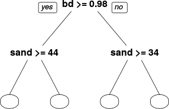

## Motivation

* DSM reaching a "young adult" state
  * "Mature"
  * "Dynamic"
* DSM implementation is not trivial
  * Large extents and/or high resolution
* Make DSM more accessible
  * Infrastructure

*** =pnotes

* BLA

---

## Not a new idea

* INTAMAP (Pebesma _et al._ 2009)

  Interpolation web service

* SIS+ (Heuvelink _et al._ 2010)

  Exploring the idea of generating maps "on-the-fly"

* Other disciplines
  * AquaMaps
  * Lifemapper
  * Biodiversity & Climate Change Virtual Laboratory

--- .nobackground

## Back in 2013... Google Earth Engine

--- .nobackground

## Back in 2015...

<!-- ---

## Some features

* Access to over 40 years of Satellite Imagery (with daily updates)
* Algorithms to analyse that data
* Google's computer clusters to analyse the data at scale
* A web-based tool for interactive data exploration -->

--- &segue .orange .nobackground

## DSM workflow
### In the cloud

<!-- ---

## User expectations

* Easy to use
* Fast

 

<strong>Try to maintain the flow</strong>

 

## Can we deliver?

 

<strong>Sometimes... but we try our best</strong>
 -->

<!-- ---

## Process soil information

* Gathering data
* Data cleansing
* Pre-processing (splines)

### EDA

* Transformations
* Dimensionality reduction

 

<strong>Hard to automatise but it can be facilitated by a platform</strong>
 -->

---

## Compile covariates

* DSM depends on environmental covariates (_scorpan_)
* Usually available as __raster images__

 

<!-- 
<strong>Big challenge in terms of disk space</strong>
 -->

<!--   -->
### Challenges

* Many datasets
* Storage
* Manage resolution
* Extract data at specific location

---

## Google Earth Engine example

\> 200 public datasets  
\> 4000 new images every day  
\> 5 million images  
\> 5 petabytes of data

*** =references

Source: GEE training materials

<!-- ---

## Other alternatives

* Amazon Web Services
* Google Cloud Storage
* Institutional repositories
  *  National Computational Infrastructure (Australia)
  * Others?

  -->

<!-- 
<strong>Usually not stored as pyramid (original images)</strong>
 -->

<!-- ---

## Extract data from covariates

* Match point observations with tiles
* Decide which resolution to use

 

<strong>Pyramid is very important</strong>

 

### "Smart" re-sampling

* Re-sample the nearest pre-computed resolution -->

---

## Model training

* Google EE has limited number of algorithms available
  * Tree-like (CART, Random Forest)
  * Perceptron
  * Support Vector Machine
  * Others
* We have been testing:
  * R (Cubist, rpart, MLR)
  * Python (scikit-learn NN)

---

## Generate map

This is probably the most critical step (time)

* Infrastructure dependent

<!-- * The prediction is made at the viewport
  * It depends on the extent
  * It depends on the zoom level (resolution) -->

 
 
 

<strong>Tiling is very important (parallel!)</strong>

--- bg:#FFF .nobackground

## Tiling

--- bg:#FFF .nobackground

## Tiling

--- bg:#FFF .nobackground

## Tiling

--- bg:#FFF .nobackground

## Tiling

--- bg:#FFF .nobackground

## Tiling

--- bg:#FFF .nobackground

## Tiling

--- bg:#FFF .nobackground

## Tiling

--- bg:#FFF .nobackground

## Tiling

---

## Uncertainty assessment

* Highly recommended (mandatory?)
* Time consuming (many iterations)

### Methods

* Bootstrapping
* Fuzzy-k means with extragrades

---

## Sharing

There are multiple alternatives:

* Raster file (potentially big files)
* Web map
* Just the model (on-the-fly)

 

--- &segue .orange .nobackground

## Our platform
### `https://mapping.soil.properties`

--- .nobackground .full_screen

--- .nobackground .full_screen

--- .nobackground .full_screen

--- .nobackground .full_screen

--- .nobackground .full_screen

--- .nobackground .full_screen

--- .nobackground .full_screen

--- .nobackground .full_screen

--- &segue .orange .nobackground

## Demo

--- .nobackground .full_screen

<video style="width: 42%; float:left" onclick='play_videos()'>
  <source src="assets/video/chile_final.mp4" type="video/mp4">
Your browser does not support the video tag.
</video>

<video style="width: 42%; float:right" onclick='play_videos()'>
  <source src="assets/video/us_final.mp4" type="video/mp4">
Your browser does not support the video tag.
</video>
 
<video style="width: 42%; float:left; margin-top:10px" onclick='play_videos()'>
  <source src="assets/video/world_final.mp4" type="video/mp4">
Your browser does not support the video tag.
</video>

<video style="width: 42%; float:right; margin-top:10px" onclick='play_videos()'>
  <source src="assets/video/uncertainty_final.mp4" type="video/mp4">
Your browser does not support the video tag.
</video>

<!-- ---

## Features

* Access large catalogue of covariates (GEE)
* Machine learning algorithms (CART, RF, MLR)
* Generation of maps on-the-fly
* Private
  * EDA client-side
  * No observations stored in the server (hash) -->

<!-- ---

## Future work

* Uncertainty assessment (Fuzzy-k means/modes)
* Equal-area splines (standard depths)
* Full implementation of R and python models
* Import/Export maps parameters and data (sharing)
* Automatic quality assessment?
* Privacy and collaborative modelling
* Replace GEE? -->

---

## Final remarks

 

<strong>Considerably decreases iteration time in map production</strong>

 

* Who should us it?
  * Individuals
  * Institutions
  * Consortia
